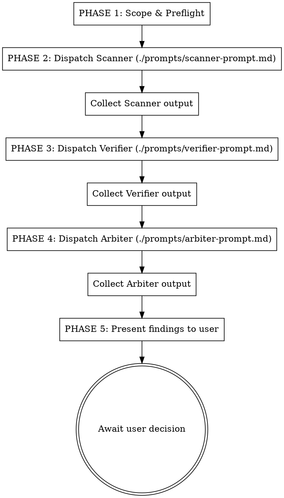

# Trident

Three-pronged code review pipeline: **Scan → Verify → Judge**.

Combines multi-lens scanning (SOLID, security, quality, dead code) with an independent 3-agent verification pipeline to produce high-confidence findings with minimal false positives.

**Core principle:** Scan broadly, verify independently, judge on evidence.

## When to Use

- Code review of git changes (PRs, commits, staged diffs)
- Deep codebase audit for bugs, security issues, logic errors
- Post-implementation review of complex features
- Security audit before release
- Any review where false positives are worse than missed minor issues

**Don't use for:** Style-only reviews, trivial one-line changes, test coverage analysis.

## Pipeline



## How to Execute

### Phase 1: Scope & Preflight

Before dispatching agents, determine the review mode and gather context.

#### Step 1: Detect Review Mode

Trident supports 4 review modes. Determine which one applies based on user input or auto-detection:

| Mode | Trigger | Diff Command | Notes |
|------|---------|--------------|-------|
| **`unstaged`** | Default — no target specified | `git diff` | Working tree changes not yet staged |
| **`staged`** | User says "staged" or unstaged diff is empty | `git diff --cached` | Changes staged for commit |
| **`all-local`** | User says "all local" or "everything" | `git diff HEAD` | Staged + unstaged combined |
| **`pr`** | User provides PR URL, PR number, or says "review PR" | `gh pr diff {N}` | Pull request diff (remote) |
| **`range`** | User provides commit range, branch name, or says "since X" | `git diff {A}..{B}` | Two commits, tags, or branches |
| **`dir`** | User provides directory path or says "review src/" | Read all files in path | Entire directory/module audit |

**Auto-detection logic:**

```
1. Did user provide a GitHub PR URL?           → mode = pr
2. Did user provide a PR number (#123)?        → mode = pr
3. Did user say "PR" or "pull request"?        → mode = pr (fetch current branch's PR via `gh pr view --json number`)
4. Did user provide a commit range (abc123..def456)? → mode = range
5. Did user provide a branch name?             → mode = range (resolve to main..branch)
6. Did user say "since" / "from" / "after"?    → mode = range (e.g., git diff v1.2..HEAD)
7. Did user provide a directory path?          → mode = dir
8. Did user say "staged"?                      → mode = staged
9. Did user say "all" / "everything"?          → mode = all-local
10. Default                                    → mode = unstaged
```

#### Step 1.5: Create Worktree for Isolation

For `pr` and `range` modes, create a git worktree so the review runs in an isolated checkout. This keeps the user's current working tree intact and enables parallel reviews of multiple PRs/branches.

**Mode: `pr`**
```bash
WORKTREE_DIR="/tmp/trident-review-pr-${PR_NUMBER}-$(date +%s)"
git worktree add "$WORKTREE_DIR" --detach
# Inside the worktree, check out the PR branch
cd "$WORKTREE_DIR"
gh pr checkout ${PR_NUMBER}
```

**Mode: `range`**
```bash
WORKTREE_DIR="/tmp/trident-review-range-$(echo ${A}..${B} | tr '/' '-')-$(date +%s)"
git worktree add "$WORKTREE_DIR" "${B}"
```

**Mode: `unstaged` / `staged` / `all-local` / `dir`**
No worktree needed — these modes operate on the current working tree. Set `WORKTREE_DIR` to the current repository root:
```bash
WORKTREE_DIR="$(git rev-parse --show-toplevel)"
```

Store `WORKTREE_DIR` — it will be passed to all three agents so they can read actual source files with real line numbers.

#### Step 2: Gather Diff and Context

Based on the detected mode, run the appropriate commands:

**Mode: `unstaged`**
```bash
git status -sb
git diff --stat
git diff
```

**Mode: `staged`**
```bash
git status -sb
git diff --cached --stat
git diff --cached
```

**Mode: `all-local`**
```bash
git status -sb
git diff HEAD --stat
git diff HEAD
```

**Mode: `pr`**
```bash
# Fetch PR metadata for context
gh pr view {N} --json title,body,author,baseRefName,headRefName,files,additions,deletions
# Fetch the diff (from within the worktree)
cd "$WORKTREE_DIR" && gh pr diff {N}
```

**Mode: `range`**
```bash
git log --oneline {A}..{B}
git diff --stat {A}..{B}
git diff {A}..{B}
```

**Mode: `dir`**
```bash
# No diff — scan all files in the target directory
find {DIR} -type f -name "*.ts" -o -name "*.py" -o -name "*.go" ... | head -50
```

**Important:** Save the diff output for context (so agents know what changed), but agents will read actual source files from `WORKTREE_DIR` for evidence and line number citations.

#### Step 3: Enrich Context

For ALL modes, also gather:
1. Use `rg` or `grep` to find related modules, usages, and contracts if needed (search within `WORKTREE_DIR`)
2. Identify entry points, ownership boundaries, and critical paths (auth, payments, data writes)
3. For `pr` mode: include PR title, description, author intent, and base branch in `{CONTEXT}`
4. For `range` mode: include commit messages in `{CONTEXT}` for intent understanding

#### Step 4: Handle Edge Cases

- **Empty diff**: If diff is empty in `unstaged` mode, auto-try `staged` mode. If both empty, ask user if they want `pr` or `range` mode.
- **Large diff (>500 lines)**: Summarize by file first, then run pipeline in batches by module/feature area.
- **Mixed concerns**: Group findings by logical feature, not just file order.
- **PR not found**: If `gh pr diff` fails, suggest user check PR number or provide diff manually.
- **Branch divergence**: For `range` mode, warn if branches have diverged significantly (>100 commits).

#### Step 5: Set Scanner Placeholders

Construct `{TARGET}`, `{CONTEXT}`, and `{WORKTREE_DIR}` for the Scanner:

- **`{TARGET}`**: The file list, diff content, or directory path to scan
- **`{CONTEXT}`**: Review mode, PR metadata (if applicable), commit messages (if range), what the code does, areas of concern
- **`{WORKTREE_DIR}`**: Absolute path to the worktree (or repo root for local modes). Agents MUST use this path to read source files and cite real line numbers.

### Phase 2: Scanner (Agent 1)

Dispatch a subagent using `./prompts/scanner-prompt.md` as the prompt template.

- Fill `{TARGET}` with the scope (files, directories, modules, or entire repo)
- Fill `{CONTEXT}` with relevant context (what the code does, recent changes, areas of concern)
- Fill `{WORKTREE_DIR}` with the absolute path to the worktree (or repo root for local modes)
- The Scanner performs multi-lens scanning (SOLID, security, quality, dead code) with forced counterarguments
- Wait for complete output before proceeding

```
Task tool:
  description: "Trident Scanner: deep scan of {TARGET}"
  prompt: [contents of ./prompts/scanner-prompt.md with placeholders filled]
```

### Phase 3: Verifier (Agent 2)

Dispatch a subagent using `./prompts/verifier-prompt.md` as the prompt template.

- Fill `{SCANNER_OUTPUT}` with the complete output from Phase 2
- Fill `{WORKTREE_DIR}` with the same worktree path used for the Scanner
- Agent has full codebase access and MUST re-read cited code independently from `WORKTREE_DIR`
- Wait for complete output before proceeding

```
Task tool:
  description: "Trident Verifier: validate findings"
  prompt: [contents of ./prompts/verifier-prompt.md with SCANNER_OUTPUT and WORKTREE_DIR filled]
```

### Phase 4: Arbiter (Agent 3)

Dispatch a subagent using `./prompts/arbiter-prompt.md` as the prompt template.

- Fill `{SCANNER_OUTPUT}` with output from Phase 2
- Fill `{VERIFIER_OUTPUT}` with output from Phase 3
- Fill `{WORKTREE_DIR}` with the same worktree path used for Scanner and Verifier
- Agent has full codebase access and re-inspects disputed/high-severity findings from `WORKTREE_DIR`
- Wait for complete output

```
Task tool:
  description: "Trident Arbiter: render verdicts"
  prompt: [contents of ./prompts/arbiter-prompt.md with all outputs and WORKTREE_DIR filled]
```

### Phase 5: Present to User

After collecting the Arbiter's final verdicts, present them in the structured output format below. **Do NOT implement any changes until user explicitly confirms.**

**Worktree Cleanup:** After presenting findings (or if the pipeline is aborted), clean up the worktree if one was created:
```bash
# Only for pr/range modes where a worktree was created in /tmp
if [[ "$WORKTREE_DIR" == /tmp/trident-review-* ]]; then
  git worktree remove "$WORKTREE_DIR" --force 2>/dev/null
fi
```

## Severity Levels

| Level | Name | Description | Action |
|-------|------|-------------|--------|
| **P0** | Critical | Security vulnerability, data loss risk, correctness bug | Must block merge |
| **P1** | High | Logic error, significant SOLID violation, performance regression | Should fix before merge |
| **P2** | Medium | Code smell, maintainability concern, minor SOLID violation | Fix in this PR or create follow-up |
| **P3** | Low | Style, naming, minor suggestion | Optional improvement |

## Shared Output Contract

All agents use a shared `bug_id` keyed schema. Each stage appends its fields:

| Field | Scanner | Verifier | Arbiter |
|-------|---------|----------|---------|
| `bug_id` | Creates | Preserves | Preserves |
| `title` | Creates | Preserves | Preserves |
| `location` | Creates | Preserves | Preserves |
| `severity` | Initial (P0-P3) | May revise | Final |
| `category` | Creates (security/solid/quality/logic/concurrency/dead-code/other) | Preserves | Preserves |
| `tier` | CONFIRMED/SUSPICIOUS | — | — |
| `status` | — | CONFIRMED/REJECTED/INSUFFICIENT_EVIDENCE | — |
| `verdict` | — | — | REAL_BUG/NOT_A_BUG/NEEDS_HUMAN_CHECK |
| `confidence` | Creates | Creates | Creates |

## Output Format

Structure your final presentation as follows:

```markdown
## Trident Review

**Files reviewed**: X files, Y lines changed
**Overall assessment**: [APPROVE / REQUEST_CHANGES / COMMENT]

---

### Confirmed Bugs (REAL_BUG)

| Bug ID | Severity | Confidence | Category | Title | Location |
|--------|----------|------------|----------|-------|----------|
| BUG-01 | P0 | HIGH | security | ... | `file:line` |

### Dismissed (NOT_A_BUG)

| Bug ID | Original Severity | Reason |
|--------|-------------------|--------|
| ... | ... | ... |

### Needs Human Review (NEEDS_HUMAN_CHECK)

| Bug ID | Severity | What Would Settle It |
|--------|----------|---------------------|
| ... | ... | ... |

---

### Removal / Iteration Plan
(if applicable — from Scanner's dead code analysis)

---

### Additional Suggestions
(optional improvements, not blocking)

---

## Next Steps

I found X issues (P0: _, P1: _, P2: _, P3: _).

**How would you like to proceed?**

1. **Fix all** — I'll implement all suggested fixes
2. **Fix P0/P1 only** — Address critical and high priority issues
3. **Fix specific items** — Tell me which issues to fix
4. **No changes** — Review complete, no implementation needed

Please choose an option or provide specific instructions.
```

**Inline comments**: Use this format for file-specific findings:
```
::code-comment{file="path/to/file.ts" line="42" severity="P1"}
Description of the issue and suggested fix.
::
```

**Clean review**: If no issues found, explicitly state:
- What was checked
- Areas not covered (e.g., "Did not verify database migrations")
- Residual risks or recommended follow-up tests

## Design Principles

1. **Independent re-inspection.** Each agent reads the actual code. No agent trusts prior text alone.
2. **Bounded recall.** Scanner has a hard cap (15 findings, max 4 suspicious). Quality over quantity.
3. **Evidence-based.** Every claim requires: specific location, concrete trigger, failure story.
4. **Forced counterargument.** Scanner must state the strongest reason each finding might be wrong.
5. **Permission to abstain.** Verifier can say INSUFFICIENT_EVIDENCE. Arbiter can say NEEDS_HUMAN_CHECK.
6. **No fictional scoring.** No fake point systems. Acceptance criteria and evidence requirements drive quality.
7. **Multi-lens scanning.** SOLID, security, code quality, and dead code — not just bug hunting.
8. **Review-first.** Never implement without explicit user confirmation.

## Red Flags

**Never:**
- Skip the Verifier stage. Without verification, false positive rate is 30-60%.
- Let Verifier or Arbiter judge without codebase access. Text-only debate produces rhetoric, not truth.
- Remove finding caps from Scanner. Unlimited findings collapse the pipeline into triage noise.
- Force binary verdicts. NEEDS_HUMAN_CHECK exists for a reason.
- Use the same model instance for all 3 agents if avoidable (consensus collapse risk).
- Implement changes before user confirms. This is review-first.
- Suppress type errors or silence diagnostics to "fix" findings.

**If pipeline produces too few findings:**
- Do NOT make Scanner more aggressive. Instead, add a second independent Scanner with different search focus and merge/dedupe before verification.

## Prompt Templates

- `./prompts/scanner-prompt.md` — Agent 1: multi-lens scan with forced counterarguments
- `./prompts/verifier-prompt.md` — Agent 2: independent verification with falsification
- `./prompts/arbiter-prompt.md` — Agent 3: evidence-based final judgment

## References

| File | Purpose |
|------|---------|
| `references/solid-checklist.md` | SOLID smell prompts and refactor heuristics |
| `references/security-checklist.md` | Web/app security and runtime risk checklist |
| `references/code-quality-checklist.md` | Error handling, performance, boundary conditions |
| `references/removal-plan.md` | Template for deletion candidates and follow-up plan |
